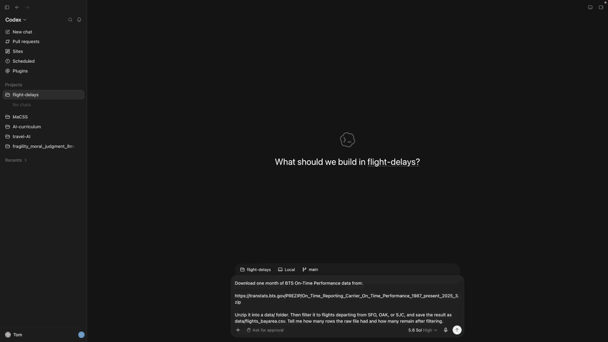

# D-Lab Agentic AI for Research Workflows Workshop

This repository contains the materials for D-Lab's Agentic AI for Research Workflows workshop.

In two hours, you'll delegate a real research project to a coding agent — downloading government flight data, exploring it, predicting delays, building a dashboard — and learn where the agent's judgment ends and yours begins. Here's the very first delegated task, sped up 6×:

## Prerequisites

No programming experience is required. If you've used ChatGPT or a similar chatbot before, you have all the background you need.

Check out D-Lab's [Workshop Catalog](https://dlab-berkeley.github.io/dlab-workshops/) to browse all workshops, see what's running now, and review prerequisites.

## Workshop Goals

Coding agents can now carry out real research work: fetching data, cleaning it, fitting models, and building interactive outputs from plain-language instructions. That power comes with a catch: every detail you don't specify, the agent decides for you.

In this workshop, we build one project end to end: predicting which flights out of SFO, OAK, and SJC will arrive late, using real government data. Along the way we practice the habits that make agent-assisted research trustworthy: inspecting the agent's steps, pinning down specifications, checking results against baselines, and turning a pile of conversations into a reproducible pipeline.

## Learning Objectives

After this workshop, you will be able to:

- Explain what a coding agent is, how it differs from a chatbot, and when to use which.
- Set up an agent project with written rules (`AGENTS.md`) and sensible permission settings.
- Delegate multi-step data work to an agent and inspect every step it took.
- Evaluate a predictive model honestly, against the baseline a trivial guess would achieve.
- Recognize the failure modes of agent-assisted analysis: silent decisions, run-to-run variation, data leakage, and metric gaming.
- Convert a conversational analysis into a written specification and a reproducible pipeline of scripts.

This workshop does not cover:

- Programming in Python or R. The agent writes the code; we read and question it.
- Machine learning theory. We use one simple model and focus on evaluating it honestly. For more, see D-Lab's [Python Machine Learning workshop](https://github.com/dlab-berkeley/Python-Machine-Learning).

## Installation Instructions

We use the **Codex app** (OpenAI's coding agent, bundled with the ChatGPT app). A free account is enough for the workshop. Before the session:

1. Download and install the [Codex/ChatGPT app](https://chatgpt.com/codex) (macOS or Windows).
2. Open the app and sign in with an OpenAI account (create a free one if needed).

## How the Workshop Runs

The workshop is hands-on: you follow along on your own machine, working in the Codex app. 

First, open this [slide deck](https://dlab-berkeley.github.io/Agentic-AI-Research-Workflows/slides/).

The [lessons](lessons/) folder has the rest of the workshop materials. Keep them open in a browser tab and copy-paste the prompts as we go:
1. [Introduction and Setup](lessons/1_Introduction_and_Setup.md)
2. [Getting the Data](lessons/2_Getting_the_Data.md)
3. [Exploring Flight Delays](lessons/3_Exploring_Flight_Delays.md)
4. [Predicting Flight Delays](lessons/4_Predicting_Flight_Delays.md)
5. [From Chat to Reproducible Workflow](lessons/5_From_Chat_to_Reproducible_Workflow.md)

# Additional Resources

- [BTS On-Time Performance data](https://www.transtats.bts.gov/) — the flight data we use, covering every US domestic flight.
- [Open-Meteo](https://open-meteo.com/) — the free historical weather API the agent joins in lesson 4.
- [AGENTS.md](https://agents.md/) — the emerging convention for giving agents project rules.
- [One Useful Thing](https://www.oneusefulthing.org/) — Ethan Mollick's newsletter on working with AI, source of the agent-jargon example in the slides.

# About the UC Berkeley D-Lab

D-Lab works with Berkeley faculty, research staff, and students to advance data-intensive social science and humanities research. Our goal at D-Lab is to provide practical training, staff support, resources, and space to enable you to use data science in your own research applications. Our services cater to all skill levels and no programming, statistical, or computer science backgrounds are necessary. We offer these services in the form of workshops, one-to-one consulting, and working groups that cover a variety of research topics, digital tools, and programming languages.

Visit the [D-Lab homepage](https://dlab.berkeley.edu/) to learn more about us. You can view our [calendar](https://dlab.berkeley.edu/events/calendar) for upcoming events, learn about how to utilize our [consulting](https://dlab.berkeley.edu/consulting) and [data](https://dlab.berkeley.edu/data) services, and check out upcoming [workshops](https://dlab.berkeley.edu/events/workshops).

# Other D-Lab Workshops

Interested in the tools behind today's workshop?

- [GPT Fundamentals](https://github.com/dlab-berkeley/GPT-Fundamentals)
- [Python Fundamentals](https://github.com/dlab-berkeley/Python-Fundamentals)
- [Python Machine Learning](https://github.com/dlab-berkeley/Python-Machine-Learning)

# Contributors

- [Pratik Sachdeva](https://dlab.berkeley.edu/people/pratik-sachdeva)
- [Tom van Nuenen](https://dlab.berkeley.edu/people/tom-van-nuenen)
- AI Agents: Codex and Claude Code
