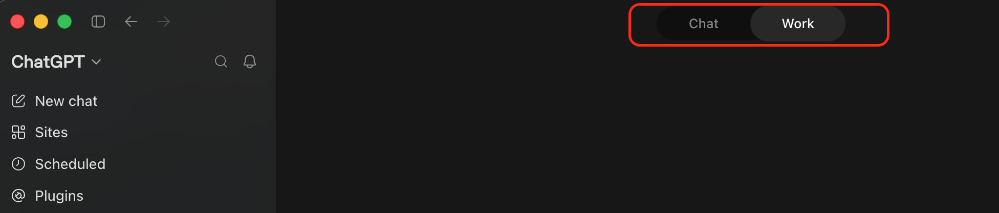
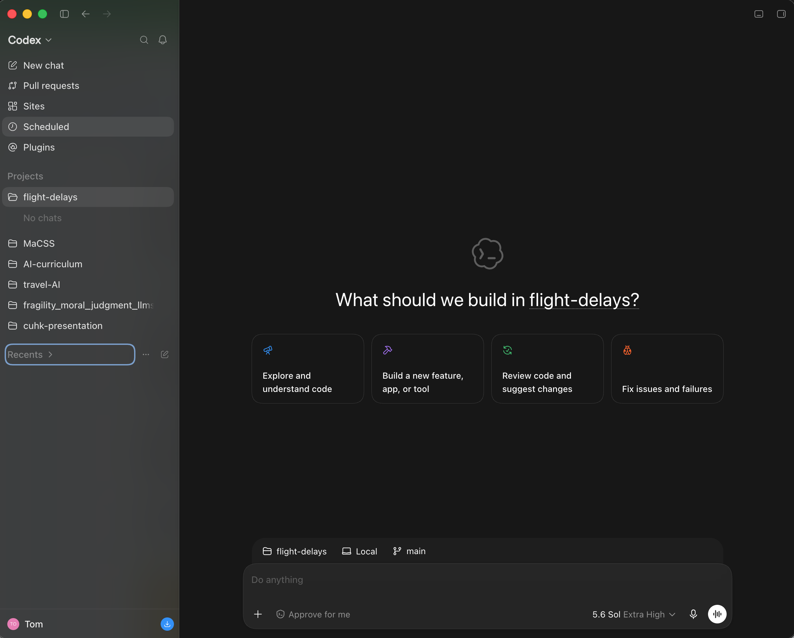
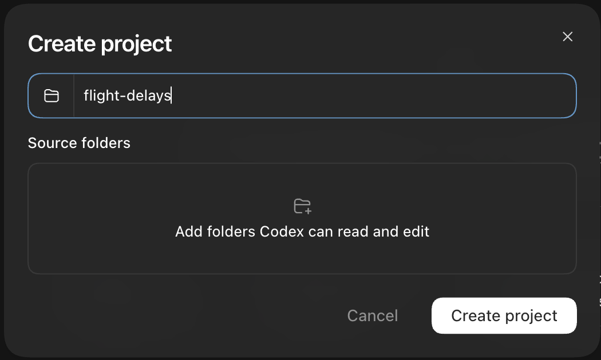
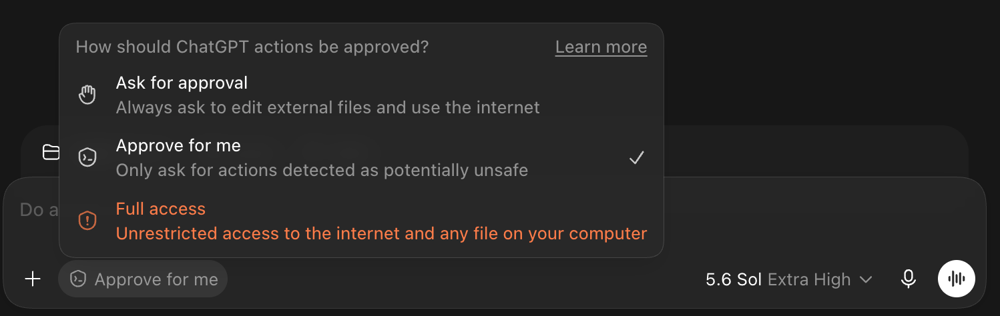

# Agentic AI for Research Workflows: Introduction and Setup

### Learning Objectives

- Distinguish a chat assistant from a coding agent.
- Download the Codex app and set up a new project.
- Create an `AGENTS.md` file that sets the rules for your agent.
- Explain what permission settings do and why they matter.

### Icons Used in This Notebook
🔔 **Question**: A quick question to help you understand what's going on.<br>
🥊 **Challenge**: Interactive exercise. We'll work through these in the workshop!<br>
💡 **Tip**: How to do something a bit more efficiently or effectively.<br>
⚠️ **Warning:** Heads-up about tricky stuff or common mistakes.<br>

### Sections
1. [What Is Agentic Programming?](#section1)
2. [Set up Codex](#section2)
3. [Create Your Project](#section3)
4. [Give Your Agent Rules](#section4)

<a id='section1'></a>

# What Is Agentic Programming?

You have probably used a chatbot like ChatGPT or Claude: you type into a box, and the chatbot generates an answer.

A **coding agent** is different in one major way: it can take actions on your computer. For example, it can read your files, write code, and run the code, and then look at the result and decide what to do next. A coding agent has *agency* to take meaningful actions in a project.

In 2025, coding agents took off. They have changed how work and research can be done, necessitating new user interfaces and workflows.

We'll be working with a coding agent called [Codex](https://chatgpt.com/codex/), which is developed by OpenAI. In mid-2026, Codex merged with the ChatGPT app, so you may have already encountered it and how it has changed the design philosophies of what it means to work with AI. There are some new principles, now:

- The agent works inside a **project folder** on your machine. That folder is its world.
- Everything it does is **recorded**. You can inspect every command it ran.
- It asks for **permission** before doing things like running commands or editing files.

🔔 **Question:** You ask a chatbot to "clean this dataset" and it gives you code. You ask an agent the same thing. What is the difference in what happens next?

💡 **Tip:** Use a browser chatbot when you want an explanation or a small snippet. Use a coding agent when the work involves your actual files.

<a id='section2'></a>

# Set up Codex

We are using the **Codex app** in this workshop. Note that it merged with the ChatGPT app, so you may already have it downloaded. It's free to use with an OpenAI account.

1. Download and install the [Codex/ChatGPT](https://learn.chatgpt.com/docs/app) app.
2. Open the app and sign in.

## The Interface

*Note that the description of the interface may be outdated, as UI development for AI products moves very quickly!*

The Codex app is actually two apps: **ChatGPT** is the chatbot, and **Codex** is the coding agent that lives alongside it. A single toggle, located in the top left of the app, switches between them.


Within ChatGPT, there is another toggle: Chat and Work. Chat is the familiar chatbot setup you're used to with ChatGPT. Work is a sort of "Codex lite" where an agent can take actions for you, but is less focused on developing code. For example, "Work" might be better suited if you're only working with, e.g., Google Docs, while "Codex" is better if you're working in a code repository.



You shouldn't worry too much about these distinctions. All signs indicate that AI products are converging on the "agent" setup where you simply talk to an agent, and it takes actions for you. So, we will be working in the "Codex" setting today.



The **sidebar** on the left has some shortcuts at the top (`New chat`, `Pull requests`, `Sites`, `Scheduled`, `Plugins`) — most of these are for software developers, and we won't need them today. The two sections that matter for us:

- `Projects`: the folders you've opened. A project bundles a folder with all the conversations you've had about it. This is where our workshop lives today.
- `Recents`: your recent conversations. These are just chats.

At the bottom is the **text box**, where you talk to the agent. This is no different from ChatGPT: type what you want in plain language and hit enter.

## Model and Effort

Inside the text box there's a small chip that reads something like `5.6 Sol High`. That's two settings: which **model** is doing the work, and how much **effort** it puts in. Click the chip to see both:


- **Model** is which "brain" you're using. Bigger and newer models are more capable, but they use up your usage limits faster.
- **Effort** is how long the model gets to think before and while it acts. Higher effort helps on hard tasks, and also burns limits faster — note the warning under `Ultra`.

For today, the defaults are fine. If you hit the free tier's usage limits partway through, switch to a smaller model or lower effort rather than stopping.

💡 **Tip:** These settings are one more reason two people can get different results from the same prompt — something we'll see up close later today.

<a id='section3'></a>

# Create Your Project

We're starting from scratch — a fresh project that will hold everything we build today.

1. In the app, switch the toggle to `Codex`.
2. Create a new project called `flight-delays`: click the `+` next to `Projects` in the sidebar, type the name, and click `Create project`. Codex creates the folder for you. [TODO: confirm at dry-run where the folder lands by default]



3. Make sure the agent is set to work **locally** — on your computer, not in the cloud. We need it working with the files on your machine.

That's it. The agent's world is now that folder. Your new project should appear under `Projects` in the sidebar.

💡 **Tip:** Not sure where the folder ended up on your computer? Ask the agent: "What folder are we in? Give me the full path."

## Conversations

Inside a project, your work is organized into **conversations**. Hover over your project in the sidebar, and click the "New Conversation" icon to start a new conversation.

The paradigm to internalize is **one conversation = one task** that you want the agent to do.

Downloading the data is a task - that's a conversation. Exploring the data is a task - that's a conversation. Fitting a model - conversation. When you move on to a new task, don't keep piling into one endless conversation. Just start a new conversation.

There are two things to keep in mind:

- **Files persist across conversations.** Anything the agent created in an earlier conversation is still in the folder, and a new conversation can see it.
- **The chat history doesn't.** A new conversation starts fresh. The agent doesn't remember what you discussed in the last one. However, the agent *can* access the project's files, instructions, shared sources, and–if enabled—memories from earlier chats. In other words: if information lives in your head, the agent doesn't have access to it unless you tell it. But if it exists in a file, the agent can search for it and use it.

🔔 **Question:** If each conversation starts with no memory of the previous ones, how does the agent know the rules of your project? 

## Permissions

Before we set the agent loose, it's worth knowing what it's allowed to do. How much freedom the agent has is a setting — click the approval chip in the prompt box to see the three levels:



- **`Ask for approval`** - always ask before editing external files or using the internet.
- **`Approve for me`** - the agent reviews its own requests, and only asks about actions it detects as potentially unsafe. Fewer pauses, but its self-review can make mistakes.
- **`Full access`** - unrestricted access to the internet and any file on your computer. Note that the app shows this one in warning-orange — that's not decoration.

⚠️ **Warning:** Set it to `Ask for approval` today, and check what your current setting is — it may not be the cautious one. `Full access` means the agent can touch anything on your computer with no review, which sometimes can lead to unintended consequences.

## 🥊 Challenge 1: Meet Your Agent

Not sure how to make use of the agent? *When in doubt, ask the agent!*. You don't even need to know what to ask - asking the agent what it can do is a valid prompt. Try:

```
This is an empty project folder. What kinds of things can you do for me here?
What can't you do?
```

What does it tell you?

<a id='section4'></a>

# Give Your Agent Rules

Agents follow instructions you put in a special file called `AGENTS.md`. Think of it as a note pinned to the wall of the project: the agent reads it every time it starts working.

Copy and paste this prompt into Codex:

```
Create a file called AGENTS.md in this project with exactly this content:

# Project rules

## Environment
- Install packages with pip into a virtual environment in this folder.

## Data
- Data files live in the data/ folder.
- Never modify raw downloaded files. Save cleaned versions as new files.
- After any filtering step, state how many rows remain.

## Analysis
- Use random_state=0 anywhere randomness is involved.
- When reporting a model's accuracy, always also report the accuracy of predicting the most common outcome for every observation.

## Workflow
- Propose a plan before creating or editing files.
- After running a command, show the exact command and summarize the result.
```

💡 **Tip:** `AGENTS.md` can steer model behavior, but it is not deterministic. Instructions can get lost, especially in long-running conversations where the context gets bloated.

# Key Points

- A **coding agent** can take actions on your computer, like reading files, writing code, and running code.
- The agent works inside a project folder, and everything it does is inspectable.
- Keep **permissions** on ask-before-acting while you're learning.
- `AGENTS.md` holds project rules your agent follows in every conversation.
- If you don't know what to ask, ask the agent what to ask.
