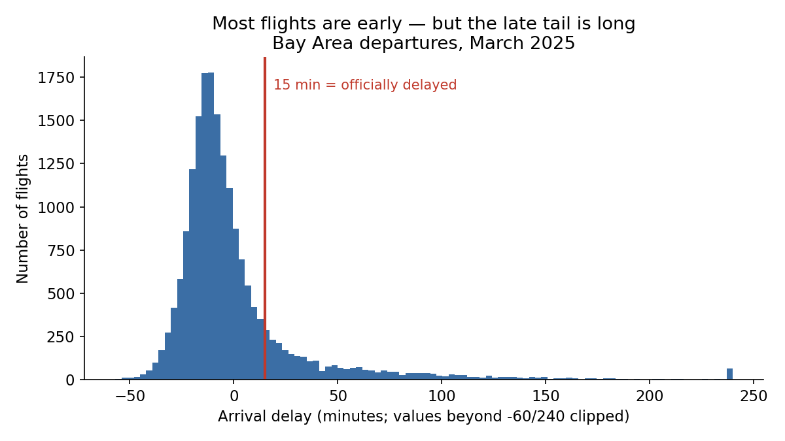
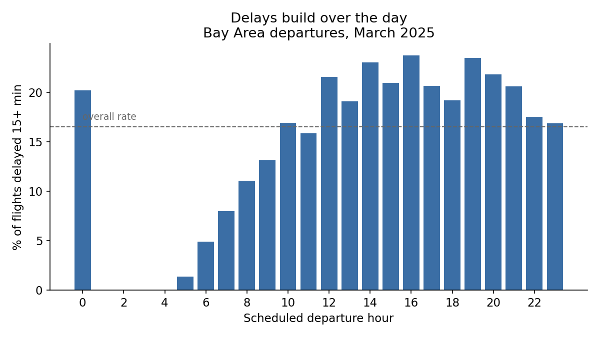

# Agentic AI for Research Workflows: Exploring Flight Delays

### Learning Objectives

- Use an agent to explore an unfamiliar dataset through conversation.
- Interpret the distribution of flight delays and the delay rate by time of day.
- Recognize that agents give different answers to the same prompt.
- Apply a shared dataset specification so everyone's dataset matches.

### Icons Used in This Notebook
🔔 **Question**: A quick question to help you understand what's going on.<br>
🥊 **Challenge**: Interactive exercise. We'll work through these in the workshop!<br>
💡 **Tip**: How to do something a bit more efficiently or effectively.<br>
⚠️ **Warning:** Heads-up about tricky stuff or common mistakes.<br>
✅ **Expected result**: What you should see if things went right. Small differences are fine; big ones are worth investigating.<br>

### Sections
1. [The Vague Prompt](#section1)
2. [Targeted Exploratory Data Analysis](#section2)
3. [Dataset Specification](#section3)

<a id='section1'></a>

# The Vague Prompt

We have a new task: exploring the data we just downloaded. Start a **new conversation** in your project. Then, open with the following vague prompt:

```
Show me the most interesting plot in this data.
```

Let it run. Then compare. A few volunteers will share their outputs.

🔔 **Question:** Same data, same prompt. Did you get the same plot as the people sharing? What does that tell you about working with agents?

Vague prompts aren't a bad thing. They can be a good way to explore your data, or a new problem. But they leave a lot of details - that you might like to be in charge of - unspecified, left for the agent to fill in.

<a id='section2'></a>

# Targeted Exploratory Data Analysis

Now, let's look at two specific things to plot, together.

## How Late Are Flights, Really?

```
Plot the distribution of arrival delays in minutes. Mark where 15 minutes falls.
```

✅ **Expected result:** Your plot won't look identical, but the shape should match this one:



Most flights are early or on time — about 70%, with a median arrival of 8 minutes *early*. But look at that right tail: a small number of flights are catastrophically late.

This is why we predict a yes/no outcome instead of the exact number of minutes: the column `ArrDel15` is 1 when a flight arrived 15+ minutes late, and 0 otherwise. That's our **target variable**, or the thing we'll predict.

🔔 **Question:** About what fraction of Bay Area flights are delayed 15+ minutes? Is "delayed" the common case or the rare case?

## When Should You Book Your Flight?

```
Plot the share of flights delayed 15+ minutes by scheduled departure hour.
```

✅ **Expected result:**



We see here one of the most reliable findings in air travel: delays build up over the day. A 6 AM flight is delayed about 5% of the time; a 4 PM flight, is delayed over 20% of the time. Early planes leave on time. By evening, the day's problems have piled up.

🔔 **Question:** There's a bar near midnight that breaks the pattern — high delay rate, very early hour. What kind of flights leave the Bay Area around midnight, and why might they be different?


## 🥊 Challenge 2: Your Own Delay Plot

Ask the agent for one plot of your own choosing that tells you something about delays. Here are some ideas, if you're stuck:

- Do airlines differ? (The codes are cryptic - ask the agent to find what they mean.)
- Are some destinations worse than others?
- Does SFO really have more delays than OAK?


<a id='section3'></a>

# Dataset Specification

We've all been exploring freely, which means our analyses have started to drift apart. Before we model, everyone needs the exact same data in the exact same shape.

Copy and paste this prompt exactly:

```
Create data/flights_clean.csv from the Bay Area flights data with exactly these columns and no others: FlightDate, Reporting_Airline, Origin, Dest, DayOfWeek, dep_hour (defined as CRSDepTime divided by 100, rounded down), Distance, DepDelay, ArrDelay, ArrDel15, Cancelled, Diverted. Keep only flights departing from SFO, OAK, or SJC. Do not drop any rows beyond that filter. Print the final row count and the fraction of flights with ArrDel15 equal to 1.
```

💡 **Tip**: We obtained this prompt by *meta-prompting*: that is, asking the agent to design a prompt for a specific task, after having a conversation with it.


✅ **Expected result:** **18,898 rows**, delay rate **0.1653** (about one flight in six).

Paste both numbers into the Zoom chat. Watch the chat fill up: everyone should have **exactly** the same two numbers — that's the point of a specification. This is the first reproducibility checkpoint of the day.

⚠️ **Warning:** If your numbers don't match, figure out why with your agent. A tiny difference in filtering now becomes a different model later. This is how reproducibility problems begin.

# Key Points

- Vague prompts work, but the agent fills in every unstated decision itself.
- The same prompt can produce different results. Agent outputs are not deterministic.
- Create specifications to ensure that your preprocessing steps are reproducible and explainable.
