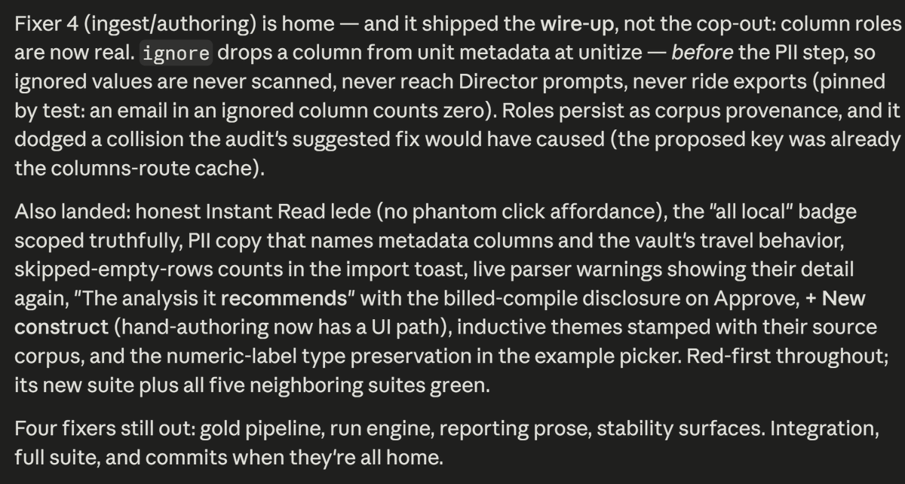

# Agentic AI for Research Workflows

<p class="subtitle">UC Berkeley D-Lab</p>

Note:
Welcome. Don't linger here; go straight to the demo.

---

## A demo

Note:
Two minutes, no more. Show the finished artifact built from flight delay data: open it, click around, let it speak for itself. Don't explain how it was made yet. This is the thing everyone will have built themselves by the end.

---

## The prompt

```text
Download last month's flight delay data from the Bureau of
Transportation Statistics, build a model that predicts which
flights run late, and make a page that shows what you found.
```

No code was written by hand.

Note:
Reveal the prompt only after the demo. The gap between one sentence of instruction and the working result is the hook. Today we build this same project step by step — and lesson 5 sends everyone home with this exact prompt, to compare the agent's one-shot decisions against the ones we made deliberately.

---

## Chatbots

<div class="chat">
  <div class="msg user">I'm getting <code>KeyError: 'DepDelay'</code>. Can you fix my code?</div>
  <div class="msg bot">
    <div class="codebox"><div class="codebar"><span>python</span><span>Copy code</span></div><pre>df = pd.read_csv("flights.csv")
delays = df["DEP_DELAY"]</pre></div>
    The column is named <code>DEP_DELAY</code>. Try this instead.
  </div>
  <div class="msg user">Ran it. Now I get <code>FileNotFoundError: flights.csv</code></div>
</div>

Nothing happens unless you make it happen.

Note:
Most of the room has used ChatGPT for code or text. Name the copy-paste loop; everyone recognizes the tedium. The mock shows the tell: a "Copy code" button. The model can't see your files, so it guesses, and you ferry every error back by hand.

---

## Agents

<div class="appwin">
  <div class="titlebar"><span class="dots"><i></i><i></i><i></i></span><span>Codex — flight-delays</span></div>
  <div class="appbody">
    <div class="sidebar">
      <div class="thread active">Plot delays</div>
      <div class="thread">New thread</div>
    </div>
    <div class="mainpane">
      <div class="msg user">Load flights.csv and plot delays by hour.</div>
      <div class="step err">Ran <code>python plot_delays.py</code> · FileNotFoundError: flights.csv</div>
      <div class="step">Listed files · found <code>data/ontime_june.csv</code></div>
      <div class="step">Edited <code>plot_delays.py</code></div>
      <div class="step ok">Ran <code>python plot_delays.py</code></div>
      <div class="reply">The file was in <code>data/</code>, so I updated the path. Plot saved to <code>figures/delays_by_hour.png</code>.</div>
    </div>
  </div>
</div>

Same model. It hit the same error, saw it, and fixed it itself.

Note:
Point at the mock: same FileNotFoundError as the chatbot slide, but this time nobody had to ferry it back. Rule of thumb for when to use which: if you'd copy-paste more than twice, use the agent. Chatbot for explanations and snippets; agent when the work involves your actual files.

---

## Research workflows with agentic AI

1. Plan your analysis
2. Have the agent conduct the analysis
3. Verify the result
4. Go to step 1

You approve the risky steps.

Note:
The one concept that makes everything else make sense: an agent is a model given tools and permission to keep going. Walk the previous slide's mock through it: planned, ran, saw the error, edited, ran again. The brake is the approval gate — the agent proposes, you approve. Lesson 1 covers the permission settings hands-on.

---

## One prompt, a hundred decisions

Whatever you don't specify, the agent decides for you.

Note:
Go back to the demo prompt: which month? which airports? what counts as "late"? what happens to cancelled flights? The prompt said none of it, and the agent decided all of it, without asking. None of those decisions were wrong, but every one of them was invisible. Finding the agent's silent decisions is most of today's work — it comes back in the EDA, the modeling, and hardest in lesson 5.

---

## The agent explains itself



Is the work unclear, or just the explanation? <span class="muted">(via Ethan Mollick)</span>

Note:
A real agent status report after a long stretch of autonomous work (shared by Ethan Mollick). Read a sentence aloud — "it shipped the wire-up, not the cop-out." On long tasks agents drift into their own private jargon, and you face a nasty ambiguity: you can't tell whether you've lost track of the work or the agent is just explaining it badly. Either way, the fix is the same — next slide.

---

## Staying in the loop

Do you still understand the output? The process?

If not: slow down. Ask the agent what's happening.

Staying in the loop is an active and ongoing process.

Note:
This is the habit to leave with. The moment you're nodding along to words like the previous slide's, stop. Ask: "explain what you just did, plainly, as if I'm new to this project." The agent will happily re-explain at any level — but only if you ask. Speed is the default; comprehension is a choice you have to keep making.

---

## Not just Codex

| | |
|---|---|
| **Codex** | free ChatGPT account · app or terminal |
| **Claude Code** | paid plans, small free tier · app, terminal, VS Code |
| **Antigravity** | free with a Google account, for now · full editor |

The research workflows work for all agents.

Note:
We use Codex today because the free tier covers the workshop. Claude Code is Anthropic's, same loop on Claude models. Antigravity is Google's, inside a full editor; any Google account works if the campus one balks. Cursor and GitHub Copilot are the same family. Pricing shifts every few months — true as of August 2026. Everything today (projects, permissions, specs) transfers.

---

## Structure of today's workshop

Today, we will use agentic AI to:

1. Download, preprocess, and analyze a large dataset of flights,
2. Build a model to predict whether a flight is delayed,
3. Build a dashboard to understand our results, and
4. Build a workflow to reproduce our analysis.

Let's begin by opening lesson 1 (`lesson/1_Introduction_and_Setup.md`) in your browser.

Note:
Drop the materials link in the Zoom chat and check everyone has it open before leaving this slide. Five lessons, one project; the slides end here and the rest of the session lives in Codex and the lesson pages. Closing reminder for the end of the day lives in lesson 5: the demo prompt returns as a take-home.
