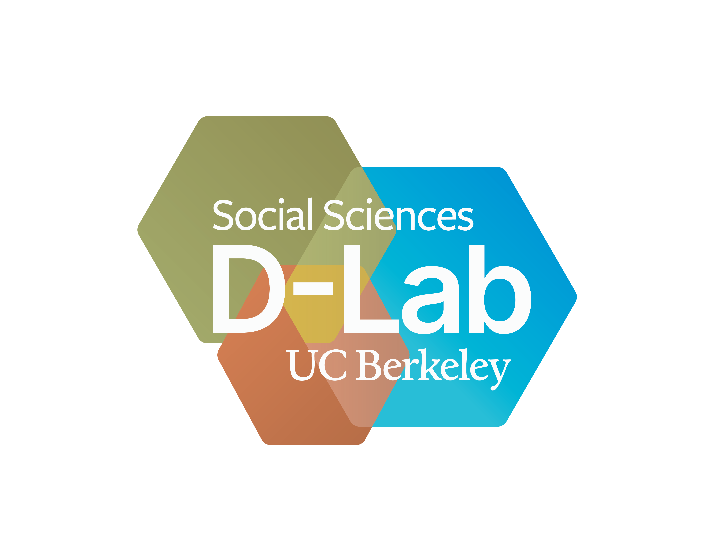
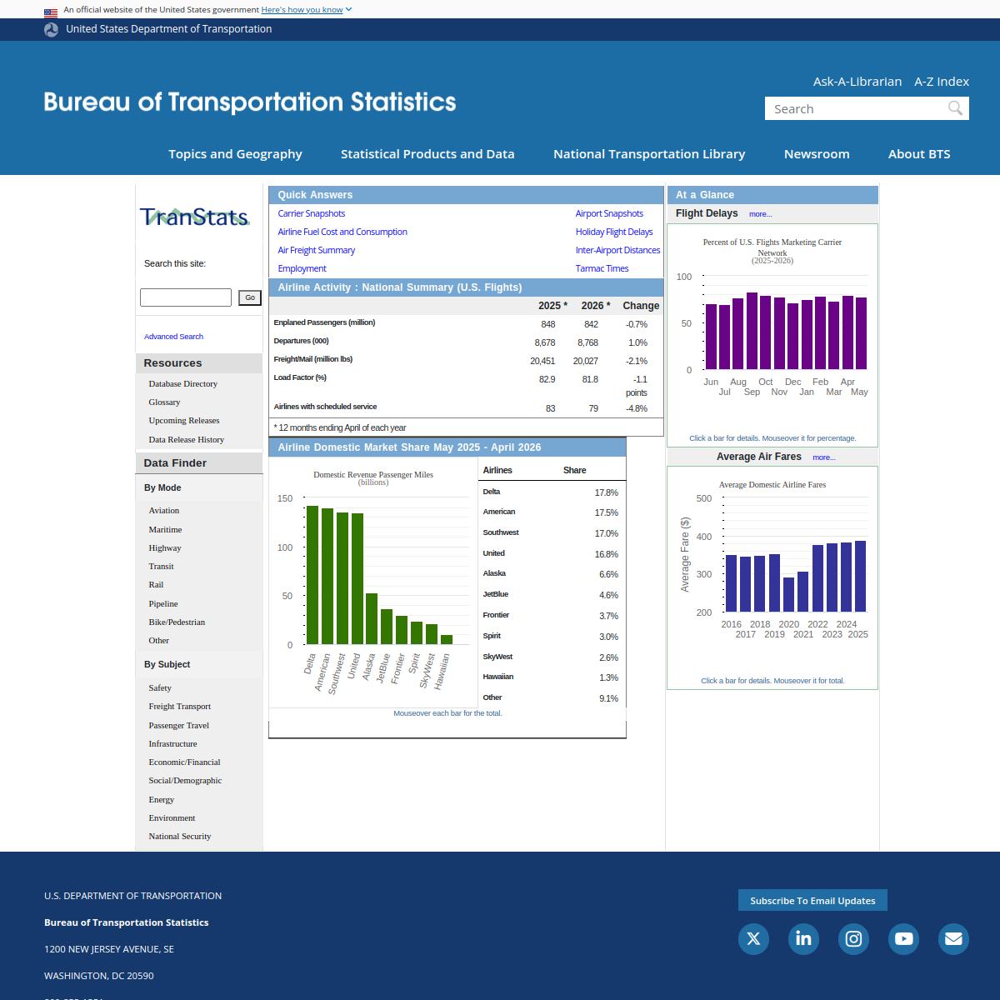
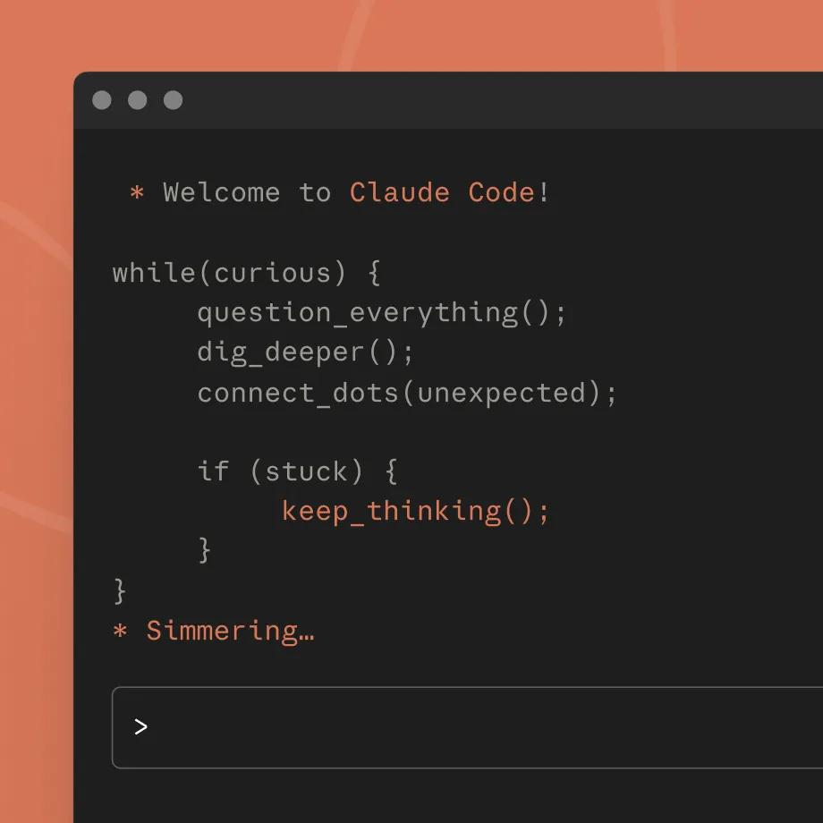
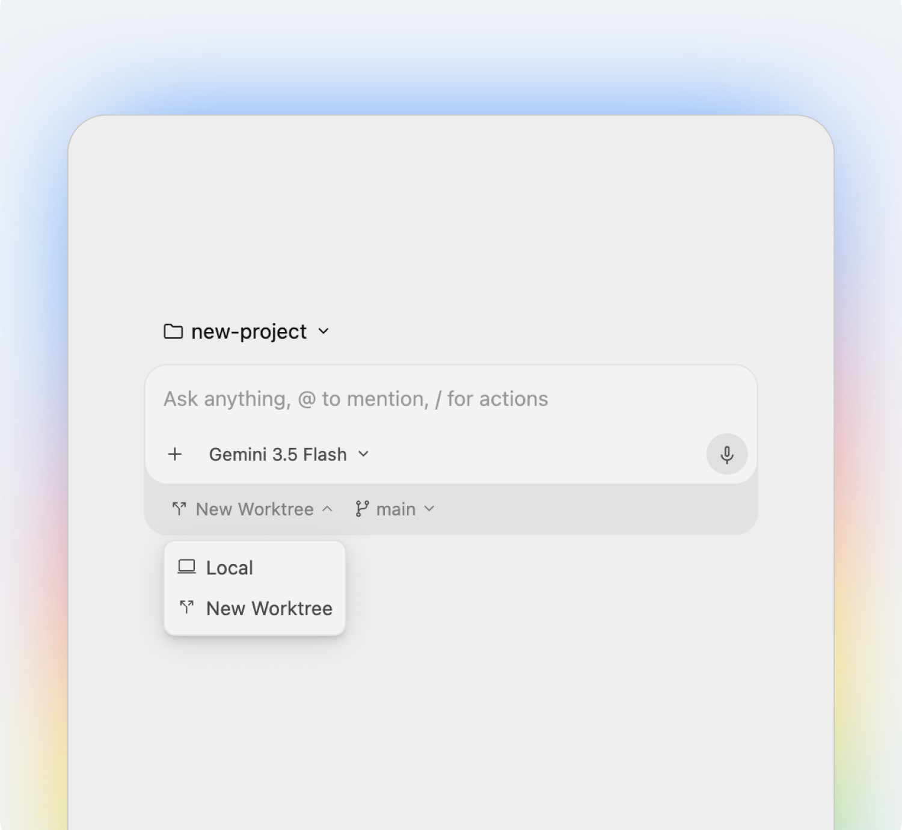

# Agentic AI for Research Workflows

<p class="subtitle">UC Berkeley D-Lab</p>

Note:
Welcome. Don't linger here; go straight to the demo.

---

## A demo

Note:
Two minutes, no more. Show the finished artifact built from flight delay data: open it, click around, let it speak for itself. Don't explain how it was made yet. This is the thing the room will have built themselves by the end.

---

## The prompt

```text
Download last month's flight delay data from the Bureau of
Transportation Statistics, build a model that predicts which
flights run late, and make a page that shows what you found.
```

No code was written by hand.

Note:
Reveal the prompt only after the demo. The gap between one sentence of instruction and the working result is the hook. Today we build this same project together, step by step, and look hard at every decision along the way.

---

## Installing Codex

Download the Codex app at [chatgpt.com/codex](https://chatgpt.com/codex) and sign in with your ChatGPT account.

A free account is enough for today.

<p class="muted">Want higher limits? <a href="https://berkeley.service-now.com/itservicehub?id=sc_cat_item&sys_id=a1a17e489771b6108b2fb9a6f053afc6&sysparm_category=3025d03adb20d010d77b38f0ad961933">ChatGPT Edu licenses</a> are available through bIT.</p>

Note:
Give people a few minutes; walk the room. The app runs on macOS (Apple Silicon) and Windows. If macOS flags the installer, right-click the app and choose Open. There's also a terminal version (npm install -g @openai/codex) for anyone who prefers it. This is where you lose people if you rush.

---

## Today

One project, start to finish: get real flight data, explore it, predict delays, ship a dashboard, and make the whole thing reproducible.

Note:
Frame: slides are signposts, most of today happens in Codex. Two threads run through everything: how much the agent can do, and how much still depends on you.

---

## Chatbots

<div class="chat">
  <div class="msg user">I'm getting <code>KeyError: 'DepDelay'</code>. Can you fix my code?</div>
  <div class="msg bot">
    <div class="codebox"><div class="codebar"><span>python</span><span>Copy code</span></div><pre>df = pd.read_csv("flights.csv")
delays = df["DEP_DELAY"]</pre></div>
    The column is named <code>DEP_DELAY</code>. Try this instead.
  </div>
  <div class="msg user">Ran it. Now I get <code>FileNotFoundError: flights.csv</code></div>
</div>

Nothing happens unless you make it happen.

Note:
Most of the room has used ChatGPT for code or text. Name the copy-paste loop; everyone recognizes the tedium. The mock shows the tell: a "Copy code" button. The model can't see your files, so it guesses, and you ferry every error back by hand.

---

## Agents

<div class="appwin">
  <div class="titlebar"><span class="dots"><i></i><i></i><i></i></span><span>Codex — flight-delays</span></div>
  <div class="appbody">
    <div class="sidebar">
      <div class="thread active">Plot delays</div>
      <div class="thread">New thread</div>
    </div>
    <div class="mainpane">
      <div class="msg user">Load flights.csv and plot delays by hour.</div>
      <div class="step err">Ran <code>python plot_delays.py</code> · FileNotFoundError: flights.csv</div>
      <div class="step">Listed files · found <code>data/ontime_june.csv</code></div>
      <div class="step">Edited <code>plot_delays.py</code></div>
      <div class="step ok">Ran <code>python plot_delays.py</code></div>
      <div class="reply">The file was in <code>data/</code>, so I updated the path. Plot saved to <code>figures/delays_by_hour.png</code>.</div>
    </div>
  </div>
</div>

Same model. It hit the same error, saw it, and fixed it itself.

Note:
The one conceptual slide that matters: agent = model + tools + a loop. Point at the mock: same FileNotFoundError as the chatbot slide, but this time nobody had to ferry it back. Rule of thumb for when to use which: if you'd copy-paste more than twice, use the agent.

---

## Starting a project

In Codex: **New Project**, name it `flight-delays`.

Things to notice: the prompt box, the model selector, the project's threads, and the stop button.

Note:
Live interface tour once everyone is in. A project is just a folder on your computer; the agent works inside it, and you can open it in Finder or Explorer to see what it makes. Show where you type, how it streams its plan and actions, how to stop it. Check the room before moving on: everyone should have an open project.

---

## The problem

Will your flight leave on time?

Every scheduled US flight is reported to the government: departure, arrival, delay, cause. That data is public. We'll use it to predict delays before they happen.

Note:
Motivate briefly: delays are relatable, the data is real and messy, and prediction gives the session a score to beat. Researchers in the room can substitute their own domain; the workflow is the point, not aviation.

---

## Getting the data by hand



Two minutes: find and download last month's on-time flight data at [transtats.bts.gov](https://www.transtats.bts.gov).

Note:
Let them actually try; the site is a maze of menus and a checkbox form from another decade. The struggle is the setup for the next slide. If the site is down, the screenshot carries the point.

---

## Getting the data with the agent

```text
Download the most recent month of on-time flight performance
data from the Bureau of Transportation Statistics
(transtats.bts.gov). Save the raw file in data/ and give me
a short summary of what's in it.
```

The agent can take over the whole errand: find the form, download, unzip, check.

Note:
Watch it navigate the same maze you just fought with. Wifi fallback: keep a cached copy of the file and let the agent discover it in data/ instead. Contrast for later discussion: you delegated the task, not the responsibility for what the data is.

---

## Permissions

The agent asked before running that command. You choose how much leash it gets:

- **read-only**: it can look and suggest, nothing more
- **ask first**: it proposes each command, you approve
- **full access**: no questions asked

Start cautious. Loosen as you learn what it does.

Note:
Teach permissions at the exact moment the first approval prompt appears. Show where the approval setting lives in the app. Full access is fine in a throwaway project folder, risky anywhere near your real files.

---

## Checking the download

```text
How many rows? What date range? Which columns have missing
values? Anything that looks wrong?
```

Name your source, then verify. "Find me some data on flight delays" gets you whatever turned up first; a named source plus a check gets you something you can cite.

Note:
Provenance moment: for research, the download step belongs in the paper trail too. This check usually surfaces real quirks: cancelled flights with missing delays, airport codes, the delay-cause columns.

---

## Exploring the data

```text
What's in this data? What looks odd about it?
```

You don't need to know what to ask. Asking what's there is enough to start.

Note:
Uncertainty as a prompt strategy: the agent is a tutor sitting inside your project. Optional detour if the room is fast: have the agent secretly corrupt a copy of the data, restart, and ask it to find the problem.

---

## First plots

```text
How do delays vary by hour of day, day of week, airline,
and airport? Make plots and save them to figures/.
```

These become the panels of our dashboard later.

Note:
Good variables to steer toward: scheduled departure hour (delays stack through the day), carrier, origin airport, day of week. Have a few people say what patterns they see. Each plot is a claim about the data; keep asking "do we believe this?"

---

## The target

`ARR_DEL15`: did the flight arrive 15 or more minutes late. Yes or no.

The question for the rest of the session: how well can we predict that before the plane leaves?

Note:
Why 15 minutes: it's the industry's official definition of "delayed", and a binary target keeps the modeling honest and simple. Everything from here on serves this one question.

---

## An open prompt

```text
Can we predict which flights will run late using this data?
What would you try?
```

Deliberately open. Let it decide.

Note:
Resist the urge to prescribe. Let everyone run this and let the agent commit to an approach before the next slide. Some will get logistic regression, some gradient boosting, different features, different metrics.

---

## Comparing notes

Same instruction, same data. What did your neighbor get?

Different model, different features, different numbers. Every gap you leave open, the agent fills with a decision.

Note:
Stop and share; this is the stochastic-process moment. Two or three people describe what their agent chose. The lesson lands by itself: identical prompts, different science. That's why the researcher, not the agent, owns the method.

---

## A specific prompt

```text
Predict ARR_DEL15 with logistic regression, using only
things known before departure. Evaluate on held-out data
and report the AUC.
```

Don't know what AUC is? Ask:

```text
What is AUC, in plain terms?
```

Note:
"Only things known before departure" matters: without it, models cheat by using departure delay to predict arrival delay. If someone's AUC looks too good, that's usually why. Leakage is a teachable moment here.

---

## Improving the model

```text
What's holding this model back? List ideas first,
don't build anything yet.
```

Note:
"List first, don't build" keeps you in the loop instead of watching it sprint off. It will likely propose: weather, the aircraft's inbound flight, airport congestion, time-of-year effects. Pick together what to build next.

---

## Feature engineering

```text
Add the weather at the origin airport around departure time.
```

```text
Add whether the aircraft flying this route arrived late on
its previous leg.
```

Rerun, and watch the AUC move.

Note:
The late-inbound-aircraft feature is usually the big winner, and it's intuitive: delays propagate through an aircraft's day. Weather requires the agent to find and join an external source (NOAA), a real multi-step errand. Score going up makes the loop visceral.

---

## The agent's decisions

```text
List every preprocessing and modeling decision you made
and the reason for each.
```

```text
What would a reviewer push back on?
```

"The agent chose it" is not a methods section.

Note:
Self-reflection point. Walk through the list it produces: imputation, encoding, the train/test split, dropped rows. For each: do we understand it, and would we defend it? This is responsibility as a requirement, not just a bottleneck.

---

## A wrong instruction

```text
Delays are normally distributed, so drop everything more than
2 standard deviations from the mean, then rerun the model.
```

It may push back once. Insist, and it complies. The output looks fine. It isn't: delay data is heavily skewed, and that filter throws away most of the delays you're trying to predict.

Note:
Run it. If the agent objects, override it ("I know what I'm doing") and show that it obeys. Then ask it what the filter removed, and compare AUC before and after. A clear prompt built on a wrong idea produces confident results built on the wrong idea.

---

## The dashboard

```text
Build a one-page dashboard: the delay patterns we plotted,
the model's performance, and what predicts delays. A single
HTML file I can open in a browser.
```

Note:
The deliverable moment; this mirrors the demo from the start of the session. If there's energy, take the zag: ask the room what THEY would want on it and build that instead. The point: the artifact is cheap now, deciding what it should say is the work.

---

## The spec sheet

```text
Write SPEC.md: every step from raw download to dashboard,
in order, including each decision we made and why.
```

You just got your methods section drafted for free.

Note:
The spec is the paper trail: data source, filters, features, model, evaluation. Have people skim it and check it against what they remember happening. Anything missing from the spec is something they couldn't defend later.

---

## Rebuilding from the spec

Start a new thread in your project, and:

```text
Read SPEC.md. Rebuild this project as numbered scripts,
01_download.py through 05_dashboard.py, that run in order.
```

Then have it run them, in order. If the rebuild fails, the spec was incomplete. That's the test.

Note:
A new thread has no memory of the exploration; the spec has to carry everything. This is reproducibility in one exercise: same steps, same result, from a written record. We're deliberately not teaching package management; running numbered scripts in order is enough for today.

---

## Responsibility

The agent executes. You still decide:

- what question is worth asking
- whether the method fits the question
- whether to believe the result

Verify the way you'd verify a capable new research assistant: trust the labor, check the judgment.

Note:
Tie the two threads together: everything today showed capability, and every stop showed where judgment was required: the open prompt, the leakage, the outlier filter, the spec review.

---

## Claude Code



Anthropic's agent. Same loop as Codex, running on Claude models. Terminal, desktop app, or VS Code.

Note:
The free tier is small, for trying it out; real use starts at 20 dollars a month. Everything from today transfers directly: projects, permissions, threads, specs. Image: claude.com product page.

---

## Google Antigravity



Google's agent, inside a full editor. Free with a Google account while in preview, running on Gemini models.

Note:
Free baseline tier with weekly limits; paid Google AI plans raise them. It's a whole IDE: agents plus a code editor plus a browser the agent can drive. Berkeley's campus Google agreement covers the Gemini app; for Antigravity, any Google account works, so if the campus account balks, a personal one will do. Image: antigravity.google.

---

## Other tools

| | |
|---|---|
| **Codex** | free ChatGPT account · app or terminal |
| **Claude Code** | paid plans, small free tier · app, terminal, VS Code |
| **Antigravity** | free with a Google account, for now · full editor |

Model, tools, permissions. Pick by what you have access to; the habits transfer.

Note:
Cursor and GitHub Copilot belong in the same family for anyone who asks. Pricing and free tiers shift every few months; what's on this slide was true in August 2026, check before you rely on it.

---

## Things move quickly

Terms younger than most PhD projects: *vibe coding*, *MCP*, *AGENTS.md*, *subagents*, *computer use*.

Specific tools will age fast. The habits, naming sources, checking decisions, verifying output, won't.

Note:
Optional: ask who has heard any of these. Dates for reference: MCP late 2024, vibe coding early 2025. The slide's job is to lower anxiety about keeping up: learn the loop, not the logos.

---

## Takeaways

- An agent is a chatbot that can act: read files, run code, see results.
- Every detail you leave out of a prompt, the agent decides for you. Find those decisions and check them.
- If the project can be rebuilt from your spec, you understood it. If not, you didn't.

---

## Resources

- D-Lab consulting, for your own research: [dlab.berkeley.edu](https://dlab.berkeley.edu)
- More workshops: [dlab-berkeley.github.io/dlab-workshops](https://dlab-berkeley.github.io/dlab-workshops/)

Thanks.


Note:
Leave time for the feedback survey and open questions.
